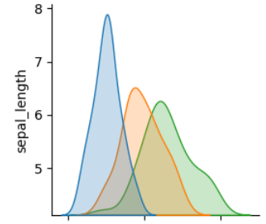
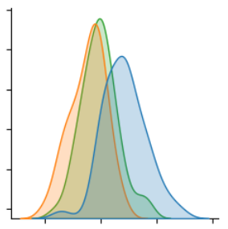
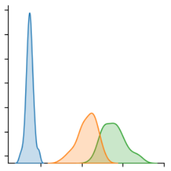
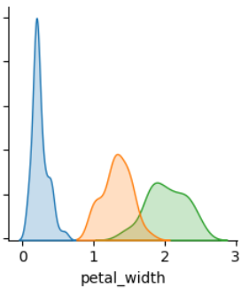

# Iris-Flower-Classification

# Overview
A multilabel-classifier that can identify the species of iris flowers based on the length and width of their leaves

# Data Collection

Data has already available [here](https://www.kaggle.com/datasets/arshid/iris-flower-dataset). The dataset contains only 150 observations with 3 species. Each species have 50 observations.

# Data Preprocessing

Data has no NULL, Duplicate value. No imbalance issue in the dataset.

# Model Training

Datasets is trained using `Logistic Regression`, `Decision Tree`, `Support Vector Machine (SVM)` and `Random Forest` classification models. 

# Result Analysis
In the table I showed the Precision, Recall, F1 score and  accuracy for three models.
<table>
<thead>
    <tr>
      <th>Model</th>
      <th>Baseline Accuracy</th>
      <th>Training Accuracy</th>
      <th>Testing Accuracy</th>
    </tr>      
  </thead>
<tbody>
  <tr>
    <td>Logistic Regression</td>
    <td>0.341</td>
    <td>0.967</td>
    <td>0.967</td>
  </tr>

  <tr>
    <td>Decision Tree</td>
    <td>0.341</td>
    <td>1.000</td>
    <td>0.967</td>
  </tr>

  <tr>
    <td>SVM</td>
    <td>0.341</td>
    <td>0.967</td>
    <td>0.967</td>
  </tr>

  <tr>
    <td>Random Forest</td>
    <td>0.341</td>
    <td>0.967</td>
    <td>0.967</td>
  </tr>
  </tbody>
</table>

All the models beat the baseline model and their performance all almost similar. Due to `Decision Tree's` flexibility it may overfit sometimes.

# Features Distribution Property

From the image, we can see that, there is a `Normal Distribution` in `Sepal Length & Width` but `Bi-Directional` in `Petal Length & Width`.

  
  
  
  

